# greenwood-library-website
Greenwood Community Library

## INTRODUCTION
This project aims at demonstrating experience in cloning a repository and working with branches in Git.It will also show experience with staging, commiting and pushing of changes to a repository. It will also showcase experience in creating pull requests, merging and resolving of conflicts.

## PROJECT DETAILS

1. ### Create a GitHub repository:

I created a GitHub repository named greenwood-library-website.

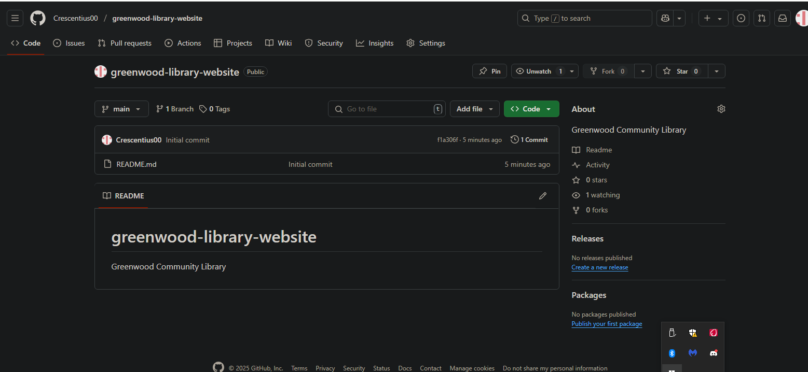

2. ### Clone repository:

I cloned the greenwood-library-website repository.

3. ### Create the webpages:

I added the following files to the main branch:
1. home.html
2. about_us.html
3. events.html
4. contact_us.html

Screenshot showing the Git CLI where I created the files can be seen below:

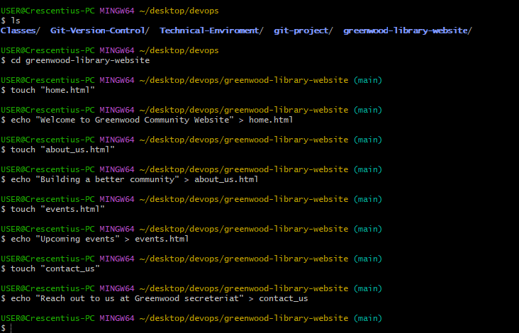

A screenshot of VS code showing the listed webpages is shown below:

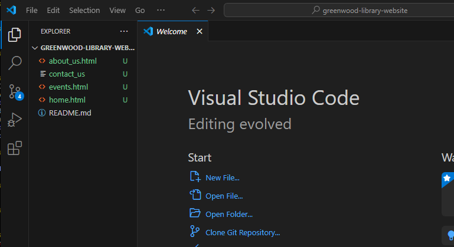

4. ### Add Page Contents:

I added contents to the various files created.

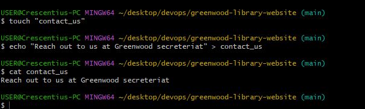

The contents are as follows:

Home: Welcome to Greenwood Community Website

About_Us: Building a better community

Events: Upcoming events

Contact_Us: Reach out to us at Greenwood secreteriat

5. ### Main branch

I staged the main branch using the "git add" command.

With the "git commit" command, I commited the main branch, the commit message is: "First commit for the main branch"

Then I pushed using the "git push" command

Screenshots below:

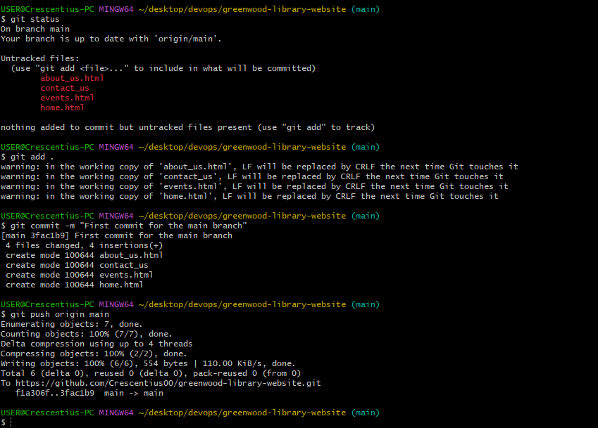

6. ### Morgan's work:

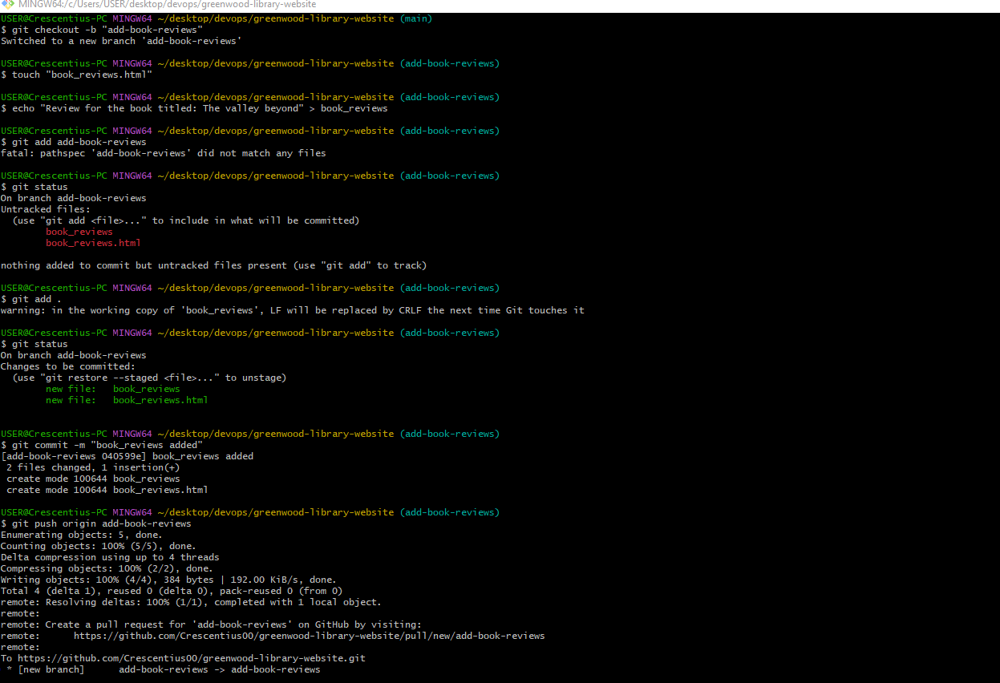

I illustrated Morgan's contribution; the steps involved are as follows:

1. created a new branch called "add-book-reviews"
2. created a new webpage called "book_reviews"
3. added contents to the page
4. staged the new file
5. commited using the commit message: "book_reviews added"
6. then I pushed the add-book-reviews branch to GitHub.

7. ### Pull request for Morgan's work:

I created pull request for Morgan's work

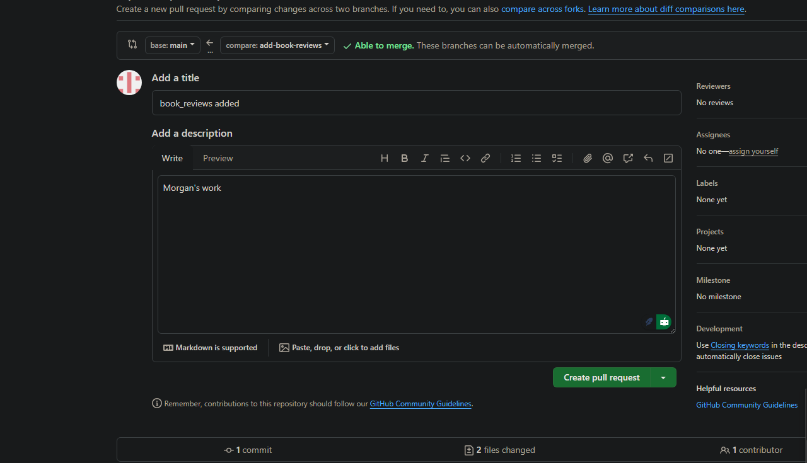

8. ### Merge Morgan's work

After reviewing Morgan's work to ensure there is no conflict, I merged the add-book-reviews branch to the main branch.

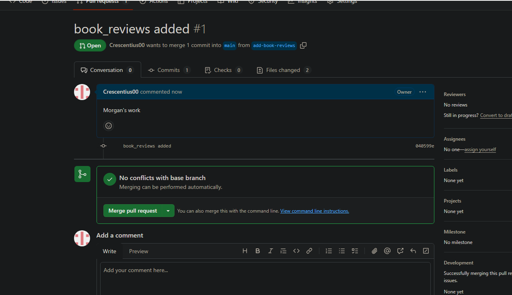

9. ### Jamie's work

Jamie pulled the main branch from GitHub to ensure he has the latest version of the project.

Then created a new branch called: "update-events"

He then made changes to the events.html file.

Then he staged, commited and pushed to the GitHub repository. The commit message is: "Updated events.html file"

Screenshot of the activities can be found below:

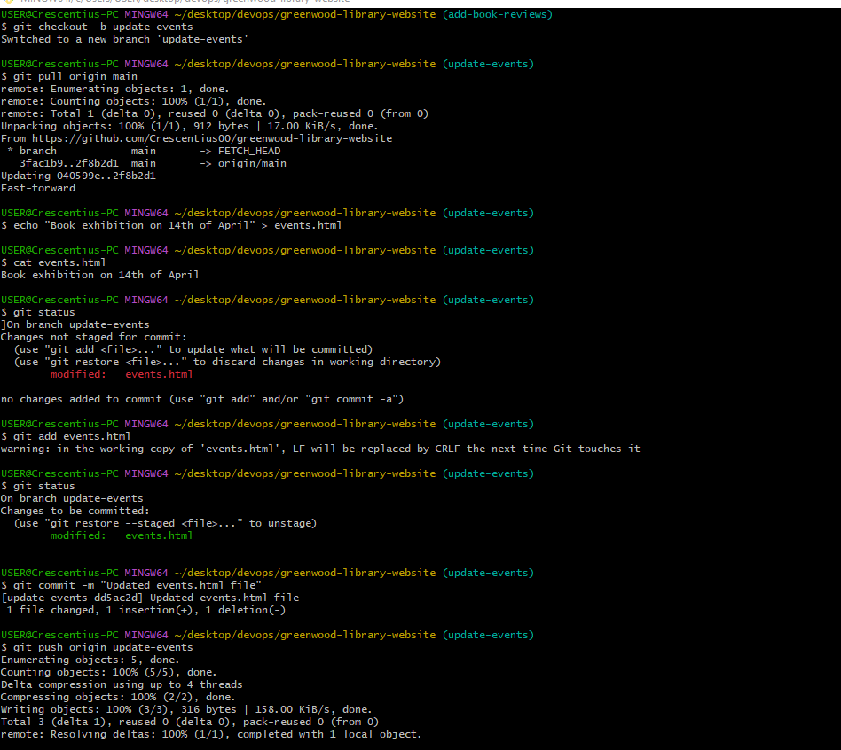

10. ### Pull request for Jamie's work

A pull request was created for the update-events branch.

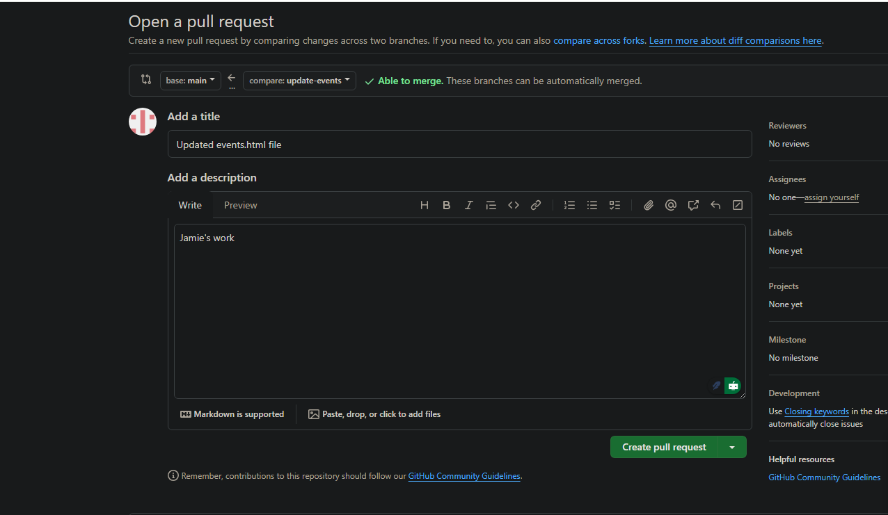

11. ### Merge Jamie's work:

After reviewing the work to ensure there is no conflict, the update-events branch was merged to the main branch

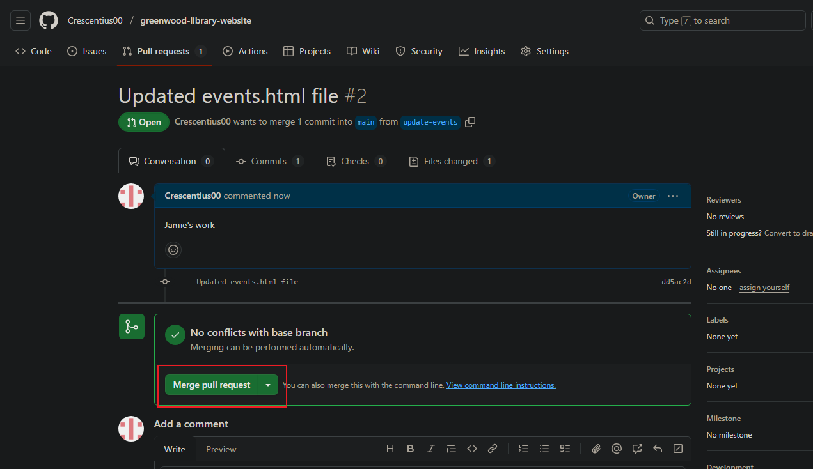.